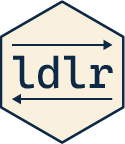

# ldlr



`ldlr` is an R interface for Linear Discriminative Learning (LDL). It
keeps data preparation, validation, model objects, diagnostics, and
reporting in R, while delegating computationally intensive operations to
Julia and [JudiLing.jl](https://github.com/quantling/JudiLing.jl). Users
work with R functions and ordinary R matrices; no Julia syntax is
required.

The package supports comprehension and production mappings, end-state,
frequency-informed and incremental learning, explicit train/test
evaluation, leave-one-out and k-fold cross-validation, orthographic
n-gram cues, LDL measures and diagnostics, and optional word-form path
finding.

## Installation

``` r

install.packages(c("JuliaConnectoR", "remotes"))
remotes::install_github("dosc91/ldlr")
library(ldlr)

setup_julia(install_julia = TRUE)
ldlr_status()
```

[`setup_julia()`](https://dosc91.github.io/ldlr/reference/setup_julia.md)
can install Julia, creates an isolated Julia environment for `ldlr`, and
installs the required Julia packages. Automatic installation uses Julia
1.12, the newest line currently compatible with JudiLing 1. If automatic
detection fails, pass the Julia executable explicitly:

``` r

setup_julia(julia = "C:/path/to/julia.exe", install_julia = FALSE)
```

## Minimal example

``` r

words <- c("walk", "walked", "talk", "talked")
cues <- make_ortho_trigrams(words, sparse = FALSE)

# S normally comes from distributional vectors such as fastText.
set.seed(1)
S <- matrix(rnorm(length(words) * 20), nrow = length(words),
            dimnames = list(words, paste0("s", 1:20)))

comprehension <- compute_comprehension(cues, S, learning = "endstate")
production <- compute_production(S, cues, learning = "endstate")

summary(comprehension)
head(compute_measures(comprehension))
```

The R-facing workflow is `C -> S_hat` for comprehension and `S -> C_hat`
for production. Internally, end-state and frequency-informed mappings
call `JudiLing.make_transform_matrix()`; incremental mappings call
`JudiLing.wh_learn()` and, when frequencies are supplied,
`JudiLing.make_learn_seq()`.

## Documentation

The [documentation site](https://dosc91.github.io/ldlr/) contains a
complete first analysis, guides to learning methods, measures,
cross-validation, the R-to-Julia architecture, troubleshooting, and a
function reference. Each function is documented first as an R operation
and then in terms of its underlying JudiLing or JudiLingMeasures
implementation. Native `ldlr` calculations are identified explicitly.

`ldlr` follows the terminology of
[JudiLingMeasures.jl](https://github.com/quantling/JudiLingMeasures.jl).
Where an upstream measure has a known correctness or edge-case problem,
the package uses a guarded Julia implementation and documents that
difference.

## Acknowledgements and references

`ldlr` is an R interface to an existing Julia implementation of Linear
Discriminative Learning. The underlying model-fitting and path-finding
infrastructure is provided by
[JudiLing.jl](https://github.com/quantling/JudiLing.jl), developed by
Xuefeng Luo and Maria Heitmeier. The organization and terminology of the
LDL measures follow
[JudiLingMeasures.jl](https://github.com/quantling/JudiLingMeasures.jl),
developed by Maria Heitmeier. Credit for the Julia implementation and
the associated methodological work belongs to these original developers
and contributors; `ldlr` provides an R-facing interface, validation, and
corrected handling of identified measure edge cases.

For the theoretical background of the Discriminative Lexicon and
detailed discussion of its implementation in JudiLing, see:

> Heitmeier, M., Chuang, Y.-Y., & Baayen, R. H. (2026). *The
> Discriminative Lexicon: Theory, Implementation in the Julia Package
> JudiLing, and Applications*. Cambridge: Cambridge University Press.
> ISBN 978-1-009-63461-8.

Software referenced by `ldlr`:

- Luo, X., & Heitmeier, M. *JudiLing.jl: An implementation for Linear
  Discriminative Learning in Julia*.
  <https://github.com/quantling/JudiLing.jl>
- Heitmeier, M. *JudiLingMeasures.jl: Measures for Discriminative
  Lexicon models developed with JudiLing*.
  <https://github.com/quantling/JudiLingMeasures.jl>

BibTeX for the book:

``` bibtex
@book{heitmeierDiscriminativeLexiconTheory,
  title = {The Discriminative Lexicon: Theory, Implementation in the Julia Package JudiLing, and Applications},
  author = {Heitmeier, Maria and Chuang, Yu-Ying and Baayen, R. Harald},
  year = {2026},
  publisher = {Cambridge University Press},
  address = {Cambridge},
  isbn = {978-1-009-63461-8}
}
```

## License

MIT. See `LICENSE.md`.
